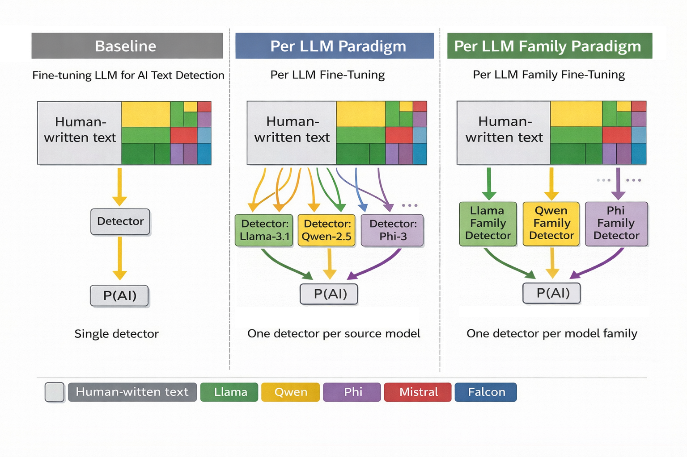
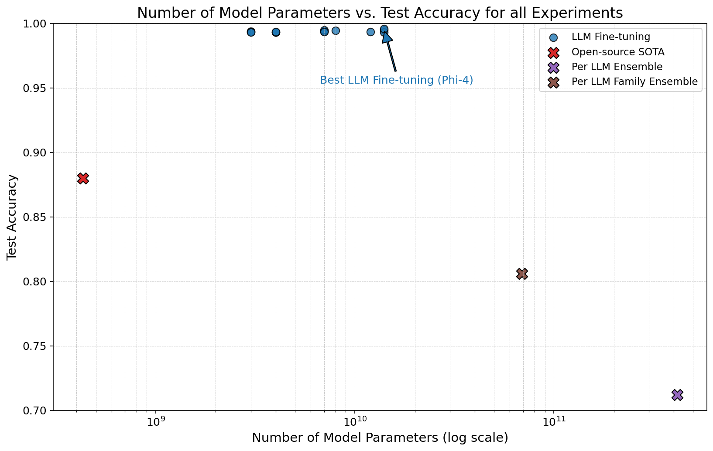

# On the Effectiveness of LLM-Specific Fine-Tuning for Detecting AI-Generated Text

Authors: `Michał Gromadzki`, `PhD in Computer Science, Anna Wróblewska` and `PhD in Linguistics, Agnieszka Kaliska` \
HF Dataset: https://huggingface.co/datasets/Majkel1337/Detect-AI 

## Overview

The rapid progress of large language models has enabled the generation of text that closely resembles human writing, creating challenges for authenticity verification in education, publishing, and digital security. Detecting AI-generated text has therefore become a crucial technical and ethical issue. This paper presents a comprehensive study of AI-generated text detection based on large-scale corpora and novel training strategies. We introduce a 1-billion-token corpus of human-authored texts spanning multiple genres and a 1.9-billion-token corpus of AI-generated texts produced by prompting a variety of LLMs across diverse domains. Using these resources, we develop and evaluate numerous detection models and propose two novel training paradigms: Per LLM and Per LLM family fine-tuning. Across a 100-million-token benchmark covering 21 large language models, our best fine-tuned detector achieves up to $99.6\%$ token-level accuracy, substantially outperforming existing open-source baselines.

## Results

The following plot summarizes the performance of the developed models in distinguishing AI-generated from human-authored texts.

## Repository Structure

1. `./logs/` - Training history for all experiments
2. `./notebooks/` - Jupyter Notebooks used for development
3. `./plots/` - Plots used in the thesis
5. `./src/` - Source code

All Jupyter Notebooks were used for the development of the solutions. They may contain errors, unused plots, or experimental solutions.

## SLURM

All `runner.sh` scripts were used to submit jobs to the SLURM Queuing System.

## Data sources

https://www.kaggle.com/datasets/kazanova/sentiment140 \
https://www.kaggle.com/datasets/smagnan/1-million-reddit-comments-from-40-subreddits \
https://www.kaggle.com/datasets/rtatman/blog-authorship-corpus \
https://www.kaggle.com/datasets/benjaminawd/new-york-times-articles-comments-2020 \
https://www.kaggle.com/datasets/thedrcat/daigt-external-train-dataset \
https://huggingface.co/datasets/liamdugan/raid \
https://huggingface.co/datasets/EdinburghNLP/xsum \
https://huggingface.co/datasets/euclaise/writingprompts \
https://huggingface.co/datasets/google-research-datasets/natural_questions